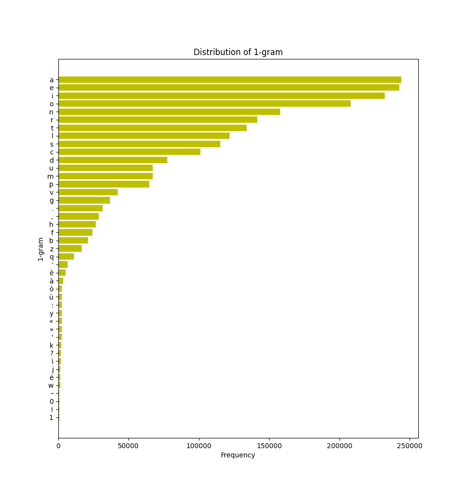
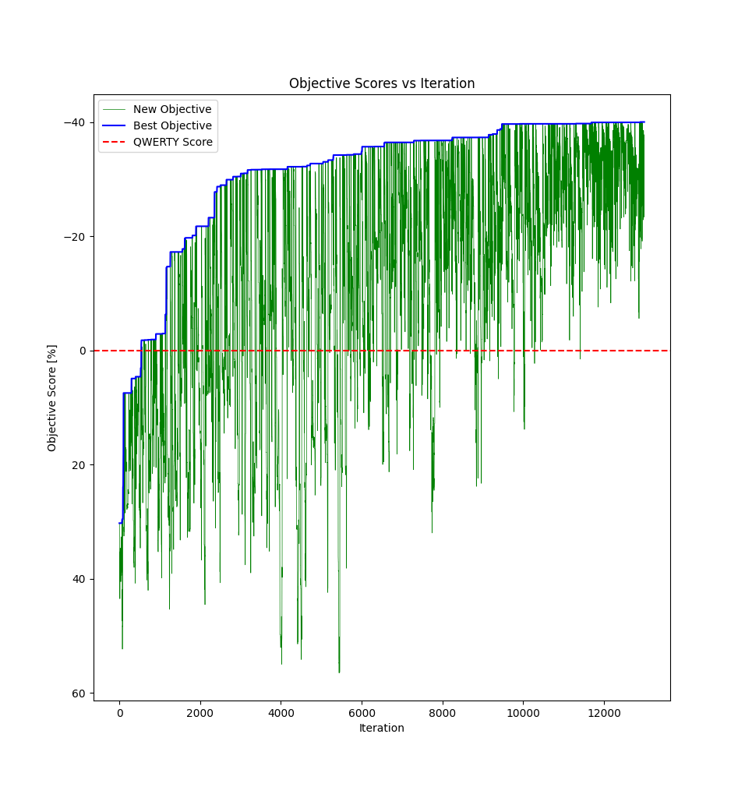
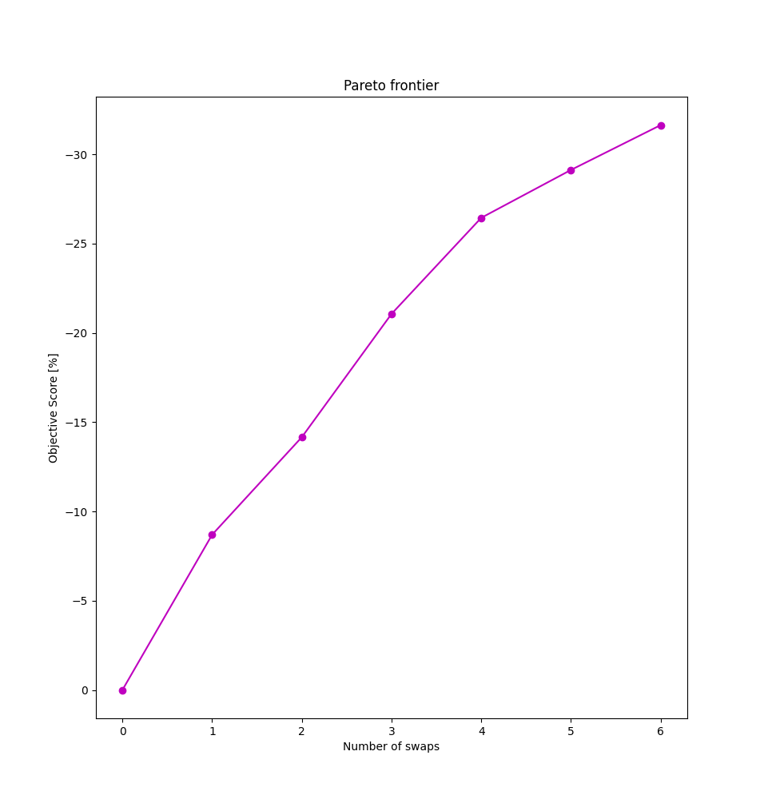
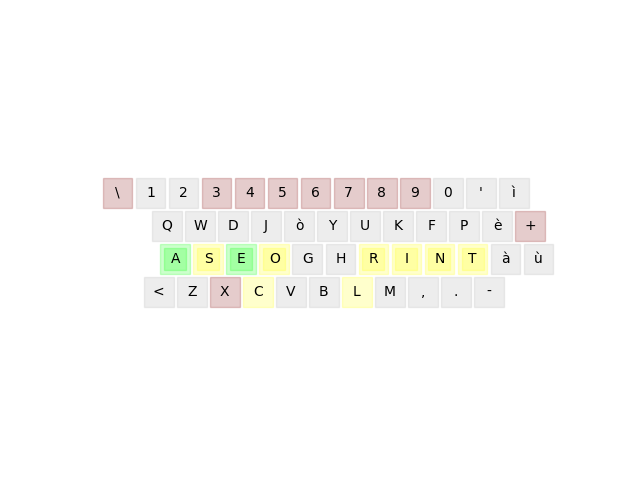

# Keymap Score

**Keymap Score** is a tool for analyzing and finding the optimal keymap for your language. It's heavily based on the work by [Atomic Frontier](https://github.com/AtomicFrontierCode/keyboards), but with some enhancements.

## Features

- **ISO Layout Support**: Adapted to work with ISO layouts.
- **ANSI Layout Support**: Keeped because widley used.
- **Written in Python**: Developed using Python programming language, making it easily understandable and editable for everyone.
- **Statistical Analysis**: Analyzes the most used monograms, bigrams, trigrams, etc., in your input data.
- **Pareto Efficiency Analysis**: Identifies the best keymap configurations based on Pareto efficiency.

## Description

The tool consists of three main components:

1. **Data Analysis (count.py)**: Analyzes input data to determine the most frequently used characters, bigrams, and trigrams. Outputs include logs and histograms of the results.

2. **Keymap Optimization (score.py)**: Utilizes the simulated annealing method to find the best keymap configuration. The score represents the percentage of less finger fatigue (compared to QWERTY or another standard) associated with each keymap.

3. **Pareto Efficiency Analysis (score.py)**: Evaluates keymap configurations found in keymap optimization for Pareto efficiency, allowing users to achieve significant improvements with minimal changes.

## Usage

### Data Analysis

Run `count.py` to analyze input data and generate logs and histograms. This is useful for customizing the *drawKeyboard()* function and highlighting the most and least used letters in your dataset.

Output for the Italian language over 4 books of data:

[](assets/plot_1gram.png)

### Keymap Optimization

Execute `score.py` to perform keymap optimization using simulated annealing. Customize various parameters to tailor the optimization process to your needs. I commented it generously to help understand each step and variable.

Below is an example graph showing the improvement achieved with simulated annealing:

[](assets/objective.png)

### Pareto Efficiency Analysis

After optimization, answer "yes" to run the Pareto efficiency analysis to identify keymap configurations that offer the best performance improvements with minimal changes.

And this one is the Pareto frontier. Just the first handful of key swaps give the most improvement.

[](assets/pareto.png)

Here the layout after 6 swaps.

[](assets/pareto_6.png)

## Setup

1. **Download and Installation**: Download the repository and set up a Python virtual environment.

    ```bash
    cd keymap-score
    python3 -m venv .venv
    source .venv/bin/activate
    pip install -r requirements.txt
    ```

2. **Input Data**: Replace `books.txt` with your input data (e.g., a book or personal notes). Please don't delete or rename the directory tree `output/score/plot-layouts`.

3. **Data Analysis**: Run `count.py` to get information about your language. Use this information to set up `score.py` parameters.

4. **Keymap Optimization**: Run `score.py` to find better (but messy) keymaps. Exploit Pareto analysis results to define your desired (and usable) keymap. Don't mix ANSI layouts with ISO keymaps or vice versa because they have different numbers of keys.

5. **Output**: Review logs and layout plots in the designated output directories.

6. **Re-Run**: If you want to run the script again, remember to empty or change the `plot-layouts` directory. Otherwise, you will get a mix of outputs.

### Windows

If you wish to run this program on Windows, follow these quick steps:

1. If you already have a Python IDE, proceed to step 5. If not, I recommend installing VS Code. During installation, ensure to install it in the suggested directory `%APPDATA%` and select the "add to PATH" option. Also, install the Python Interpreter and choose the "add to PATH" option for it as well.

2. Open VS Code and install the Python extension.

3. Navigate to the `keymap-score` folder.

4. Open the terminal (View > Terminal) and switch the profile from PowerShell to Command Prompt (locate the option near the "+" icon in the top right corner of the Terminal tab).

5. Set up the Python virtual environment:

    ```cmd
    python -m venv .venv
    .venv\Scripts\activate
    pip install -r requirements.txt
    ```

6. Open the command palette (View > Command Palette...), search for "Select Python Interpreter," and choose the one from the `.venv` environment.

7. Modify all the file paths in the `count.py` and `score.py` files as follows:

    ```
    dir/subdir-1/subdir-2       # suitable for Linux
    dir\\subdir-1\\subdir-2     # suitable for Windows
    ```

These steps will ensure smooth execution of the program on your Windows system.

## Customization

There are plenty of variables and parameters to edit. Here is a list of the most noteworthy.

In the first part of the code, I declare some keyboard-related lists and dictionaries. Remember to acknowledge the difference between the number of keys ISO and ANSI layouts have. So, if you want to create your region keymap, ensure to verify the correct number and position of keys and edit accordingly.

```
traditionalLayoutMap = physical positions of the keys, number of keys, rows, finger associated with each key, and if the key is a home-key for a finger.

QWERTYgenome = ordered list of standard Italian keymap starting from top left.

letterlist = alphabetical order of the QWERTYgenome.

keyMapDict = contains each key standard and shifted symbol.

text_file = path to the file to analyze.
```

Penalties are the way to measure the score. They are:

- **travel distance** of the finger from the home key
- use of the **same finger** twice (or more) in a row
- use of the **same hand** twice (or more) in a row
- **which finger** is used. some finger are weaker than others, so pressing a key with my left pinky is harder than doing it with my right index
- **rows are different**, keys on the home row are easier to press than the ones on the numbers row

```
fingerCPM & rowCPM = your personal clicks per minute with fingers and rows.

effortWeighting = the weight to assign to each penalty. If you want to exclude some of them, assign 0 at the correct index.
```

At the end of the file, after all the function definitions, there is the RUN section. *runSA()* is the simulated annealing analysis. This will may take several times mainly based on your `book.txt` file size. You have to find the correct sizing of it with enough words to be statistically acceptable, but not so much that it will take 20 days of calculus.

Some ways you can edit *runSA()* are the initialize variables.

```
temperature = counter that will decrease with cooling rate. When it reaches value 1, it stops the analysis. This is the best way to arrest it because it means that all the cycles are done with the right amount of annealing.

num_iterations = hard cap the maximum allowed number of iterations you want to wait. This is used to calculate the worst-case scenario execution time printed in the console after the first iteration. If you have done things correctly, you will reach temperature=1 before the max iteration number.
```
The *paretoEfficiency()* function will stop when 2 or more objectives for different swaps at the same time get the same results. This is an approximation, but it is fair to assume that this happens only after the considerable ones are found with a sample big enough.

## Credits

Even though the idea came to me on my own, I researched and discovered that the quest for the perfect layout is a topic studied by others as well. Below are the sources I used.

- [Atomic Frontier](https://www.youtube.com/watch?v=188fipF-i5I): simulated annealing approach.
- [adumb](https://www.youtube.com/watch?v=EOaPb9wrgDY): code avaiable only for sponsors.
- [sandsquare](https://www.youtube.com/watch?v=xDQXokCON-w): single hand keymap layout.
- [kaievns](https://github.com/kaievns/keyboard-genetics): seems legit but I don't know JavaScript, so I cannot tweak it to work for ISO layout.

## License

This project is licensed under the [MIT License](LICENSE).
